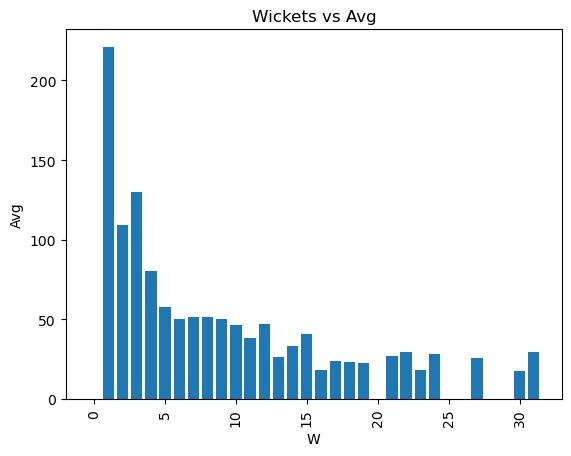

<html>
<title>INFORMATION VISUALIZATION</title>

<head>
    
</head>

<body>
    <h1>18CSE301J-INFORMATION VISUALIZATION</h1>
    <h2>ALLEN D BENJAMIN  (RA2011026010240)</h2>
    <h2>TABLEAU PROJECT</h2>
   
    
<noscript></noscript><object class='tableauViz'  style='display:none;'><param name='host_url' value='https%3A%2F%2Fpublic.tableau.com%2F' /> <param name='embed_code_version' value='3' /> <param name='site_root' value='' /><param name='name' value='odileaderboard&#47;Dashboard2' /><param name='tabs' value='no' /><param name='toolbar' value='yes' /><param name='static_image' value='https:&#47;&#47;public.tableau.com&#47;static&#47;images&#47;od&#47;odileaderboard&#47;Dashboard2&#47;1.png' /> <param name='animate_transition' value='yes' /><param name='display_static_image' value='yes' /><param name='display_spinner' value='yes' /><param name='display_overlay' value='yes' /><param name='display_count' value='yes' /><param name='language' value='en-US' /></object>
                
        
  
</body>
    <!-- Assignment 2 -->

    

      <h1>ASSIGNMENT 2</h1>
      <h2>Python - Plotly</h2>
      

        
        
      

    

    

    
</html>
